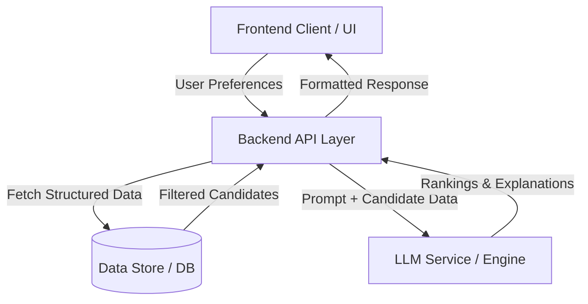

# System Architecture: AI-Powered Restaurant Recommendation System

This document outlines the detailed technical architecture for the Zomato-inspired AI recommendation service described in `context.md`. 

## 1. High-Level Architecture Overview

The system follows a standard modern 3-tier architecture with an added AI/LLM layer. It is designed to quickly filter structured data based on strict user constraints and then use an LLM to perform qualitative ranking and generate personalized explanations.

## 2. Core Components & Technology Stack Recommendations

### A. Frontend Layer (User Interface)
**Purpose**: Collect user preferences and display the AI's recommendations beautifully.
- **Framework**: React.js, Next.js, or Vue.js. (Next.js recommended for SEO and fast loading).
- **Styling**: TailwindCSS or Vanilla CSS with a premium, dynamic design (glassmorphism, modern typography).
- **Responsibilities**:
  - Form validation for Location, Budget, Cuisine, and Rating.
  - Display loading states while the LLM is processing.
  - Render the final list with Restaurant Name, Cuisine, Rating, Estimated Cost, and the AI-generated explanation.

### B. Backend Layer (Integration & API)
**Purpose**: Act as the orchestrator between the UI, the Data Store, and the LLM.
- **Framework**: Python (FastAPI or Flask) or Node.js (Express). Python is highly recommended due to its rich AI and data processing ecosystem.
- **Responsibilities**:
  - Receive user preferences via REST API or GraphQL endpoints.
  - Perform the initial structured query against the database (e.g., `WHERE location='Delhi' AND budget='low' AND rating >= 4.0`).
  - Construct the prompt dynamically using the filtered candidate restaurants and user preferences.
  - Manage API calls to the LLM service (handling retries, timeouts, and token limits).

### C. Data Layer (Data Ingestion & Storage)
**Purpose**: Store and rapidly query the Zomato dataset.
- **Data Source**: Hugging Face Dataset (`ManikaSaini/zomato-restaurant-recommendation`).
- **Processing**: A one-time Python script (using Pandas) to clean, normalize, and ingest the dataset.
- **Storage**:
  - *Option 1 (Simple)*: In-memory Pandas DataFrame (if the dataset is small enough).
  - *Option 2 (Scalable)*: Relational Database (PostgreSQL / SQLite) for fast structured filtering.
  - *Option 3 (Advanced)*: Vector Database (ChromaDB / Pinecone) if we want to add semantic search capabilities later (e.g., matching "cozy date night spot" to reviews).

### D. AI / LLM Engine (Recommendation & Reasoning)
**Purpose**: Provide the "human touch", rank the top options, and explain *why* they are good fits.
- **Provider**: Groq (for fast inference with open-source models like Llama 3 or Mixtral).
- **Integration Tool**: LangChain or direct API SDKs.
- **Prompt Engineering**: The prompt must explicitly instruct the LLM to output a structured format (like JSON) so the backend can easily parse the "AI-generated explanation" and "Rank".

## 3. Detailed Data Flow (Step-by-Step)

1. **User Request**: User submits preferences: `{ "location": "Bangalore", "cuisine": "Italian", "budget": "medium", "min_rating": 4.2, "extra": "romantic" }`.
2. **Hard Filtering**: The Backend queries the Data Layer. It retrieves a subset of restaurants (e.g., top 10 matching the strict criteria of Location, Cuisine, Budget, and Rating).
3. **Prompt Construction**: The Backend builds a prompt:
   *"The user wants a romantic Italian restaurant in Bangalore with medium budget and >4.2 rating. Here are 10 candidates from our database: [JSON array of candidates]. Rank the top 3 and provide a 2-sentence explanation for each on why it fits the 'romantic' vibe."*
4. **LLM Inference**: The LLM processes the prompt and returns a structured JSON response containing the top 3 ranked restaurants and their personalized explanations.
5. **Response Delivery**: The Backend merges the LLM's explanations with the original restaurant data (Cost, exact Rating) and sends it to the Frontend to be displayed.

## 4. Scalability and Optimization Considerations
- **Caching**: Implement Redis to cache identical queries (e.g., "Top Italian in Delhi") to save LLM costs and reduce latency.
- **Pagination/Limits**: Always limit the number of candidates passed to the LLM to avoid exceeding context token limits.
- **Streaming**: Stream the LLM response to the frontend so the user sees results typing out in real-time, drastically improving perceived performance.
